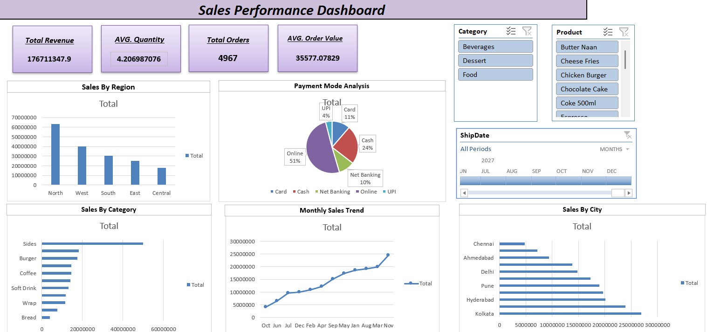

# 📊 Sales Analytics Dashboard

## 📌 Project Overview
This project is an interactive Sales Analytics Dashboard built using Microsoft Excel. It helps analyze sales performance through key performance indicators (KPIs), charts, and filters, enabling quick business insights and data-driven decision-making.

---

## 🎯 Objectives
- Analyze sales performance.
- Monitor revenue and order trends.
- Identify top-performing products and categories.
- Visualize business insights using charts and KPIs.

---

## 📈 Key Performance Indicators (KPIs)
- 💰 Total Revenue
- 🛒 Total Orders
- 📦 Average Order Value (AOV)
- 📦 Average Quantity

---

## 📊 Dashboard Features
- Interactive Dashboard
- KPI Cards
- Sales Trend Analysis
- Category-wise Sales Analysis
- Region-wise Performance
- Product Performance
- Clean and User-Friendly Layout

---

## 🛠️ Tools Used
- Microsoft Excel
- Pivot Tables
- Pivot Charts
- Slicers
- Excel Formulas
- Conditional Formatting

---

## 📁 Files Included
- `Sales_Dashboard.xlsx` – Cleaned dataset
- `dashboard.png` – Dashboard screenshot
- `README.md` – Project documentation

---

## 📷 Dashboard Preview

---

## 📚 Skills Demonstrated
- Data Cleaning
- Data Analysis
- Dashboard Design
- KPI Reporting
- Business Intelligence
- Excel Data Visualization

---

## 🚀 Learning Outcome
This project enhanced my skills in Excel, data visualization, dashboard creation, and business analytics by transforming raw sales data into meaningful insights.

---

## 👩‍💻 Author
**Ruhi Tarware**

BCA Student | Aspiring Data Analyst

---
GitHub:
https://github.com/ruhitarware

LinkedIn:
www.linkedin.com/in/ruhi-tarware

---
⭐ If you found this project useful, consider giving it a star!
